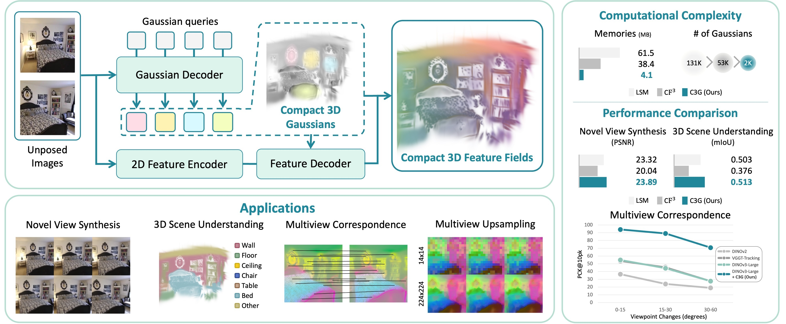

<p align="center">
  <h1 align="center">C3G: Learning Compact 3D Representations <br> with 2K Gaussians</h1>
  <p align="center">
    <a href="https://hg010303.github.io/">Honggyu An</a><sup>1*</sup>
    ·
    <a href="https://crepejung00.github.io/">Jaewoo Jung</a><sup>1*</sup>
    ·
    <a href="">Mungyeom Kim</a><sup>1</sup>
    .
    <a href="https://kchyun.github.io/">Chaehyun Kim</a><sup>1</sup>
    ·
    <a href="https://sites.google.com/view/minjeon/home">Minkyeong Jeon</a><sup>1</sup>
    ·
    <a href="https://onground.github.io/">Jisang Han</a><sup>1</sup>
    ·
    <a href="">Kazumi Fukuda</a><sup>3</sup> <br>
    <a href="">Takuya Narihira</a><sup>3†</sup>
    .
    <a href="">Hyuna Ko</a><sup>1</sup>
    .
    <a href="">Junsu Kim</a><sup>1</sup>
    .
    <a href="https://sunghwanhong.github.io/">Sunghwan Hong</a><sup>2†</sup>
    ·
    <a href="https://www.yukimitsufuji.com/">Yuki Mitsfuji</a><sup>3,4†</sup>
    .
    <a href="https://cvlab.kaist.ac.kr/members/faculty">Seungryong Kim</a><sup>1†</sup>
  </p>
  <h4 align="center"><sup>1</sup>KAIST AI, <sup>2</sup>ETH AI Center, ETH Zurich, <sup>3</sup>SONY AI, <sup>4</sup>Sony Group Corporation</h4>

  <p align='center'><sup>*</sup>Co-first author, †Co-advising author</p>

  <h3 align="center">CVPR 2026</h3>
  <h3 align="center"><a href="https://arxiv.org/abs/2512.04021">Paper</a> | <a href="https://cvlab-kaist.github.io/C3G">Project Page</a></h3>
  <div align="center"></div>
</p>

<p align="center">
  <a href="">
    
  </a>
</p>

> We propose a feed-forward framework for learning 
<b>compact 3D representations</b> from unposed images. 
Our approach estimates only <b>2K Gaussians</b> that allocated in meaningful regions 
to enable generalizable scene reconstruction and understanding. 

### 🚀 What to Expect
- [x]  Pretrained weights. <br>
- [ ] Preprocessed version of Replica dataset. <br>
- [ ] Multi-view novel view synthesis evaluation code. <br>
- [ ] Probe3d evaluation code.

## Installation

Our code is developed based on pytorch 2.5.1, CUDA 12.4 and python 3.11. 

We recommend using [conda](https://docs.anaconda.com/miniconda/) for installation:

```bash
conda create -n c3g python=3.11
conda activate c3g

pip install torch==2.5.1 torchvision==0.20.1 torchaudio==2.5.1 --index-url https://download.pytorch.org/whl/cu124
pip install -r requirements.txt
```

Then, you should download VGGT pretrained weights from [VGGT](https://github.com/facebookresearch/vggt/tree/main). Create a folder named `pretrained_weights` and save the file as `model.pt`.

Here is an example:
```
mkdir -p pretrained_weights
wget https://huggingface.co/facebook/VGGT-1B/resolve/main/model.pt?download=true -O ./pretrained_weights/model.pt
```


For LSeg feature lifting, you should download LSeg pretrained weights.
```
gdown 1FTuHY1xPUkM-5gaDtMfgCl3D0gR89WV7 -O ./pretrained_weights/demo_e200.ckpt
```

## Data Preparation
For training and multi-view novel view synthesis evaluation, we use the preprocessed [RealEstate10K](https://google.github.io/realestate10k/index.html) dataset following  [pixelSplat](https://github.com/dcharatan/pixelsplat) and [MVSplat](https://github.com/donydchen/mvsplat).

For 3D scene understanding evaluation, we use [ScanNet](http://www.scan-net.org/) following [LSM](https://github.com/NVlabs/LSM/blob/main/data_process/data.md) and use [Replica](https://github.com/facebookresearch/Replica-Dataset), which we follow preprocessing and evaluation protocol of [Feature 3DGS](https://github.com/ShijieZhou-UCLA/feature-3dgs).

## Pretrained Weights
Our pretrained checkpoints are available on [Hugging Face](https://huggingface.co/honggyuAn/C3G/tree/main).

* `gaussian_decoder.ckpt`: Gaussian Decoder trained for 2-view input.

* `gaussian_decoder_multiview.ckpt`: Gaussian Decoder trained for multi-view input.

* `feature_decoder_lseg.ckpt`: Feature Decoder trained with the LSeg model.

* `feature_decoder_dinov3L.ckpt`: Feature Decoder trained with the DINOv3-L model.

* `feature_decoder_dinov2.ckpt`: Feature Decoder trained with the DINOv2-L model.

## Training
### Gaussian Decoder Training
To train the Gaussian Decoder, you can run the following commands.

To train the Gaussian Decoder:
```bash
python -m src.main +training=gaussian_head wandb.mode=online wandb.name="wandb_name"
```
To train the Gaussian Decoder when multi-view is available:
```bash
python -m src.main +training=gaussian_head_multiview wandb.mode=online wandb.name="wandb_name"
```
To train the Gaussian Decoder faster when multi-view is available, you can continue from the 2-view training settings:
```bash
python -m src.main +training=gaussian_head wandb.mode=online wandb.name="wandb_name" checkpointing.load="2view_checkpoint" model.decoder.low_pass_filter=0.3
```
If you do not want to log to wandb, just set `wandb.mode=disabled`

### Feature Decoder Training
To train Feature Decoder, you can run the following commands.
> [!IMPORTANT]
> **Update the CUDA Rasterizer**
> When you change the model, you must update `NUM_SEMANTIC_CHANNELS` in the config file.
>
> **File:** `./submodules/diff_gaussian_rasterization_w_feature_detach/cuda_rasterizer/config.h`
>
> **Values:**
> * 512 for LSeg
> * 768 for DINOv2-base
> * 1024 for DINOv2-large / DINOv3-large
> * 128 for VGGT-tracking
<!-- <b>IMPORTANT:</b> When you change the model, you should change the cuda rasterizer. You should change the `NUM_SEMANTIC_CHANNELS` in `./submodules/diff_gaussian_rasterization_w_feature_detach/cuda_rasterizer/config.h` with each feature extractor's feature dimension. <br>
(e.g., 512 for LSeg, 768 for DINOv2-base, 1024 for DINOv2-large, DINOv3-large, or 128 for VGGT-tracking) -->


To train the Feature Decoder with various VFM models (We tested LSeg, DINOv2-base, DINOv2-large, DINOv3-large, and VGGT-Tracking):
```bash
## for LSeg
python -m src.main +training=feature_head_lseg wandb.mode=online wandb.name="wandb_name" model.encoder.pretrained_weights="2view_checkpoint"

## for DINOv2-base
python -m src.main +training=feature_head_dinov2_B wandb.mode=online wandb.name="wandb_name" model.encoder.pretrained_weights="2view_checkpoint"

## for DINOv2-large
python -m src.main +training=feature_head_dinov2_L wandb.mode=online wandb.name="wandb_name" model.encoder.pretrained_weights="2view_checkpoint"

## for DINOv3-large
python -m src.main +training=feature_head_dinov3_L wandb.mode=online wandb.name="wandb_name" model.encoder.pretrained_weights="2view_checkpoint"

## for VGGT-tracking
python -m src.main +training=feature_head_vggt wandb.mode=online wandb.name="wandb_name" model.encoder.pretrained_weights="2view_checkpoint"
```
If you do not want to log to wandb, just set `wandb.mode=disabled`

This is an example of training the Feature Decoder when multi-view input is available:
```bash
## for LSeg
python -m src.main +training=feature_head_lseg_multiview wandb.mode=online wandb.name="wandb_name" model.encoder.pretrained_weights="multiview_checkpoint"
```

## Evaluation

Evaluation code of novel view synthesis on RealEstate10K dataset when only 2 view is available.
```bash
python -m src.main +evaluation=re10k mode=test dataset/view_sampler@dataset.re10k.view_sampler=evaluation dataset.re10k.view_sampler.index_path=assets/evaluation_index_re10k.json test.save_compare=true wandb.mode=online checkpointing.load="checkpoint_path" wandb.name="wandb_name" 
```

Evaluation code of novel view synthesis on the RealEstate10K dataset when multi-view is available.

```bash
python -m src.main +evaluation=re10k_multiview mode=test dataset/view_sampler@dataset.re10k.view_sampler=evaluation dataset.re10k.view_sampler.index_path=assets/evaluation_index_re10k.json test.save_compare=true wandb.mode=online checkpointing.load="checkpoint_path" wandb.name="wandb_name" 
```

Evaluation code of 3D scene understanding on the ScanNet dataset.

```bash
python -m src.main +evaluation=scannet wandb.mode=online mode=test test.save_compare=true test.pose_align_steps=1000 checkpointing.load="checkpoint_path" wandb.name="wandb_name" 
```
If you do not want to log to wandb, just set `wandb.mode=disabled`


## Citation

```
@article{an2025c3g,
  title={C3G: Learning Compact 3D Representations with 2K Gaussians},
  author={An, Honggyu and Jung, Jaewoo and Kim, Mungyeom and Hong, Sunghwan and Kim, Chaehyun and Fukuda, Kazumi and Jeon, Minkyeong and Han, Jisang and Narihira, Takuya and Ko, Hyuna and others},
  journal={arXiv preprint arXiv:2512.04021},
  year={2025}
}
```

## Acknowledgement
We thank the authors of [VGGT](https://github.com/facebookresearch/vggt) and [NoPoSplat](https://github.com/cvg/NoPoSplat) for their excellent work and code, which served as the foundation for this project.
